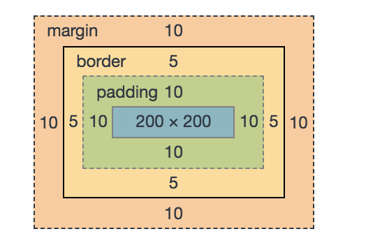
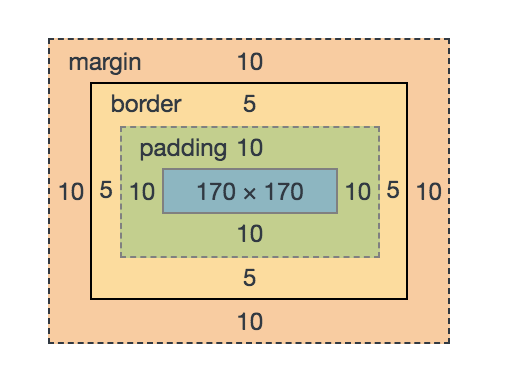

### box-sizing

允许你以某种方式定义某些元素，以适应指定区域。

- content-box: 内容的宽高是指定元素的宽高，box的宽高是指定元素的宽高加上指定元素的填充和边框
- border-box: 内容的宽高是指定元素的宽高减去指定元素的填充和边框，box的宽高是指定的元素的宽高

#### content-box

```js
.demo {
  width: 200px;
  height: 200px;
  border: 5px solid #F00;
  padding: 10px;
  margin: 10px;
  background-color: #f3e4e5;
  box-sizing: content-box;
}
```

#### content-box 效果



#### border-box

```js
.demo {
  width: 200px;
  height: 200px;
  border: 5px solid #F00;
  padding: 10px;
  margin: 10px;
  background-color: #f3e4e5;
  box-sizing: border-box;
}
```

#### border-box 效果



