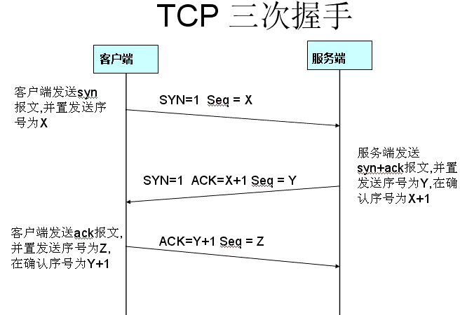

### TCP

#### IP 和 TCP

IP 即 Internet Protocol(因特网协议) 负责联网主机之间的路由选择和寻址

TCP 即 Transmission Control Protocol(传输控制协议) 负责在不可靠的传输信道上提供可靠的抽象层

TCP 负责在不可靠的传输信道上提供可靠的抽象层，向应用层屏蔽大多数网络通信的复杂细节，比如丢包重发、按序发送、拥塞控制及避免、数据完整等等。

采用 TCP 数据流可以确保发送的所有字节能够完整地被接收，而且到达客户端的顺序也是一样，因此几乎所有的 HTTP 流量都是通过 TCP 传达的。

因此理解 TCP 的某些核心机制成为优化 Web 体验的必修课。

#### 三次握手

所有 TCP 连接一开始都要经过三次握手。

所有使用 TCP 的应用具有非常大的性能影响，每次传输数据之前，都必须经历一次完整的往返。

#### 栗子

如果客户端在纽约，服务器在伦敦，要通过光纤启动一次新的 TCP 连接，光三次握手都需要花 56 ms。延迟完全取决于客户端和服务器之间的往返时间。

#### 拥塞预防及控制

##### 1.流量控制

流量控制是一种预防发送端过多向接收端发送时数据的机制。

##### 2.慢启动

流量控制确实可以防止发送端过多发送数据，但却没有机制预防任何一端向潜在网络过多发送数据。换句话说，发送端和接收端在连接建立之初，谁也不知道可用带宽是多少。

慢启动导致客户端与服务器之间经过几百毫秒才能达到接近最大速度的问题，对于小文件传输，非常不利。

##### 3.拥塞预防

拥塞预防算法把丢包作为网络拥塞的标志。

#### 队首拥塞

每个 TCP 分组都会带着一个唯一的序列号被发出，而所有分组必须按顺序传送到接收端，如果中途有一个分组没有接收到，后续的分组必须保存在接收端的 TCP 缓冲区，等到丢失的分组。

### 优化建议

#### 核心原理

* TCP 三次握手增加了整整一次往返时间
* TCP 慢启动将被应用到每个新连接
* TCP 流量及拥塞控制会影响所有连接的吞吐量
* TCP 的吞吐量由当前拥塞窗口大小控制

现代高速网络中 TCP 连接的数据传输速度，往往会受到接收端和发送端之间往返时间的限制。大多数情况下，TCP 的瓶颈是延迟而非带宽。

#### 服务器配置调优

##### 1.增大 TCP 的初始拥塞窗口

加大起始拥塞窗口可以让 TCP 在第一次往返就能传输较多的数据

##### 2.慢启动重启

在连接空闲时禁用慢启动可以改善瞬时发送数据的长 TCP 连接的性能

##### 3.窗口缩放

启用窗口缩放可以增大最大接收窗口大小，可以让高延迟的连接达到更好吞吐量

##### 4.TCP 快速打开

在某些条件下，允许在第一个 SYN 分组中发送应用程序数据

#### 应用程序优先调优

* 再快也快不过什么也不用发送，能少发就少发
* 缩短传输距离
* 重用 TCP 连接是关键

#### 性能检查清单

* 把服务器内核升级到最新版本
* 确保 cwnd(拥塞窗口大小) 大小为10
* 禁言空闲后的慢启动
* 确保启动窗口缩放
* 减少传输冗余数据
* 压缩要传输的数据
* 把服务器放到距离用户近的地方减少往返时间
* 尽最大可能重用已经建立的TCP连接

### UDP

UDP (User Datagram Protocol, 用户数据报协议)

#### 数据报

一个完整、独立的数据实体，携带着从源节点到目的地节点的足够信息，对这些节点间之前的数据交换和传输网络没有任何依赖。

#### 分组和数据报

分组可以用来指代任何格式化的数据块，而数据报通常只用来描述那些通过不可靠的服务传输的分组，既不保证送达，也不发送失败通知。

#### 无协议服务

* 不保证消息交付
* 不保证交付顺序
* 不跟踪连接状态
* 不需要拥塞控制

#### 针对 UDP 的优化建议

* 应用程序必须容忍各种因特网路径条件
* 应用程序应该控制传输速度
* 应用程序应该对所有流量进行拥塞控制
* 应用程序应该使用与 TCP 相近的带宽
* 应用程序应该准备基于丢包的重发计数器
* 应用程序应该不发送大于路径 MTU 的数据报
* 应用程序应该处理数据报丢失、重复和重排
* 应用程序应该足够稳定以支持 2 分钟以上的交付延迟
* 应用程序应该支持 IPv4 UDP 校验和，必须支持 IPv6 校验和
* 应用程序可以在需要时使用 keep-alive
