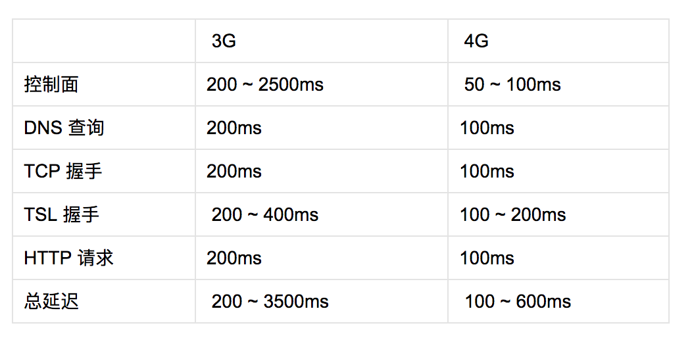

### 无线网络

#### 两个重要的效应

**远近效应**

接收端捕获较弱的信号，因而不可能检测到较弱的信号，实际上是“挤出”了较弱的信号

**小区呼吸效应**

小区覆盖范围或信号传输距离基于噪声大小和干扰级别扩展和收缩

#### 无线性能

可用带宽和信噪比是影响任何无线信道容量的两个主要物理因素。

#### 无线电的通信特征

- 通过共享的通信媒体(无线电波)实现
- 在管制下使用特定频率范围
- 在管制下使用特定的发射功率
- 受限于不断变化的背景噪声和干扰
- 受限于所选无线技术的技术约束
- 受限于设备本身的限制，比如形状、电源等等

#### 影响无线网络性能的因素

- 收发端的距离
- 当前位置的背景噪声大小
- 来自同一网络其他用户的干扰大小
- 来自相邻网络其他用户的干扰大小
- 两端发射功率大小
- 处理能力及调制算法

#### wifi

以太网标准过去依赖于概率访问的 CSMA协议，采用了冲突检测机制。

#### CSMA（载波监听多路访问）

实际上就是先听后说的一种算法。

- 检查是否有人在正在发送
- 如果信道忙，监听并等待信道空闲
- 信道空闲后，立即发送数据

#### CSMA/CD(冲突检测机制)

如果检测到冲突，则双方都立即停止发送数据并小睡一段随机的时间，从而保证发生冲突的发送端不会同步，并不会同时重新开始发送数据。

wifi 采用的是冲突避免(CSMA/CA)机制，即每个发送方都会在自己认为信道空闲时发送数据，以避免冲突。

对于以太网来说，媒体就是物理线缆，对于 Wi-Fi 而言，媒体则是无线信道。

#### Wi-Fi 性能的重要因素

- Wi-Fi 不保证用户的带宽和延迟
- Wi-Fi 的信噪比不同，带宽也随之不同
- Wi-Fi 的发射功率被限制在 200 mW 以内
- Wi-Fi 在 2.4 GHz 和较新的 5 GHz 频段中的频谱有限
- Wi-Fi 信道分配决定了接入点信号会重叠
- Wi-Fi 接入点与客户端争用同一个无线信道

#### 针对 Wi-Fi 的优化建议

- 利用不计流量的带宽
- 适应可变带宽
- 适应可变的延迟时间

### 移动网络

#### 用户面单向延迟

用户面单向延迟是 LTE 标准规定的一个目标时间，指的是一个分组在无线设备与无线发射塔之间单向传输的时间。换句话说就是设备处于大功率连续接收状态时，第一跳的延迟时间。

#### 抖动

移动网络的主要问题其分组延迟的摇摆不定，或者叫抖动。

核心网络延迟在移动网络中经常占到分组总延迟的相当部分。

### 移动网络的优化建议

#### 节约用电

- 全功率打开无线电模块只消几小时就可耗尽电量
- 对无线电功率的需求随着无线标准演进与代俱增
- 无线电模块的耗电量仅次于设备的屏幕
- 数据传输时无线电通信的耗电过程是非线性的

#### 消除周期性及无效的数据传输

- 轮询在移动网络中代价极高，少用
- 尽可能使用推送和通知
- 出站和入站请求应该合并和汇入
- 非关键性请求应该推迟到无线模块活动时进行

#### 如果考虑实时更新的需求

- 最佳更新间隔多长，是否符合用户预期
- 除了固定的更新间隔，能否因地因时制宜
- 入站或出站请求能否集合为更少的网络调用
- 入站或出站请求能否推迟到以后发送

对于 Web 应用来说，可以使用 SSE 和 WebSocket 以降低延迟时间和协议推迟，尽可能不使用轮询和更耗资源的 XHR 技术。

基于时间间隔、环境、用户偏好、甚至电池电量，简单地把多个通知集合到一个推送事件中，可以显著提升任何应用的电池效率。

间歇的信标请求很容易破坏电池电量优化策略。渐进增强和增量加载等技术依赖的间歇网络访问，会带来较长的延迟。

#### 消除不必要的长连接

不必要的长连接会有可能极大地消耗电量。

#### 预测网络延迟上限

**往返延迟**

假设最理想情况下 4G 网络的往返时间为 100ms，3.5G 网络的往返时间为 200ms。

一个 HTTP 请求的延迟时间

就这还没有考虑服务器响应时间、响应大小呢，这些也需要几次往返，最多可能到达 6 次。再乘以往返时间，那么 3G 网络的延迟可能长达数秒，4G 网络大约也要半秒。

#### 爆发传输数据并转为空闲

把请求分组，尽可能多和快地下载数据，然后让无线模块转为空闲。

渐进加载资源在移动网络中弊大于利，每次只下载一点数据会导致应用的吞吐量和延迟都摇摆不定，同时消耗的电量可能更多。

允许设备关闭无线模块，保持其空闲，不要忘了优化和消除间歇性传输。

#### 把负载转移到 Wi-Fi 网络

#### 遵从协议和应用最佳实践
