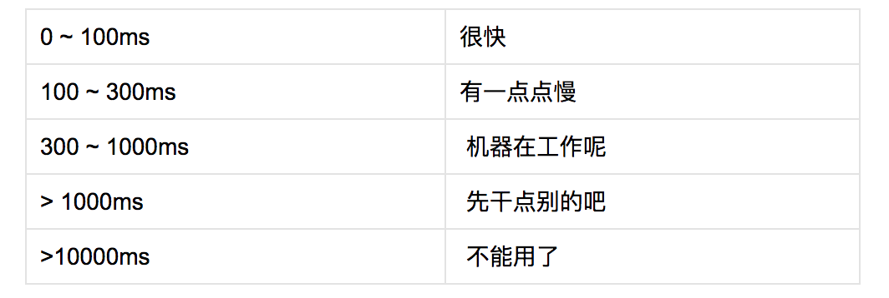

### HTTP 0.9

只有一行的协议。

- 客户端 / 服务器，请求/响应协议
- ASCII 协议，运行于 TCP/IP 链接之上
- 设计用来传输超文本文档
- 服务器与客户端之间的连接在每次请求之后都会关闭

### HTTP 1.0

- 请求可以由多行首部字段构成
- 响应对象前面添加了一个响应状态行
- 响应对象有自己的由换行符分割的首部字段
- 响应对象不局限于超文本
- 服务器与客户端之间的连接在每次请求之后都会关闭

HTTP 1.0 对每个请求都打开一个新的 TCP 连接严重影响性能。

### HTTP 1.1

- 持久连接
- 分块编码传输
- 字节范围请求
- 增强的缓存机制
- 传输编码及请求管道

#### Request Header

- Host
- User-Agent
- Accept
- Accept-Encoding
- Accept-Language
- Accept-Charset
- Cookie
- Connection: Close

#### Response Header

- Server
- Connection: keep-alive/Close
- Content-type
- Content-Length
- Date
- Expires
- Last-Modified
- Etag
- Cache-Control
- Transfer-Encoding

HTTP 1.1 默认使用持久连接。HTTP 1.0 也可以使用持久连接，需要通过 Connection: Keep-Alive 首部来启用。

### HTTP 2.0

HTTP 2.0 的主要目标是改进传输性能，实现低延迟和高吞吐量。

#### Web 性能要点

- 延迟和带宽对 Web 性能的影响
- TCP 对 HTTP 的限制
- HTTP 协议自身的功能和缺陷
- Web 应用的发展趋势及性能需求
- 浏览器局限性和优化思路

#### 时间和用户感知

必须 250ms 内渲染页面，或者至少提供视觉反馈，才能保证用户不走开

eg: Bing 搜索网页时延迟 2000ms 会导致每用户收入减少 4.3%；页面加载时间增加 1s，会导致转化率损失 7%，页面浏览量减少 11%，客户满意度降低 16。

### 性能来源

Web 应用的执行主要涉及三个任务：取得资源、页面布局和渲染、JavaScript 执行。

#### 延迟是性能瓶颈

大多数 HTTP 数据流都是小型突发性数据流，而 TCP 则是为持久连接和大块数据传输而进行过优化的。网络往返时间在大多数情况下都是 TCP 吞吐量和性能的限制因素。

#### 针对浏览器的优化建议

- CSS 和 JavaScript 等重要资源应该今早在文档中出现
- 应该今早交付 CSS，从而解除渲染阻塞并让 JavaScript 执行
- 非关键性 JavaScript 应该推迟，以避免阻塞 DOM 和 CSSDOM 构建
- HTML 文档由解析器递增解析，从而保证文档可以间隙发送，以求最佳性能

#### 从核心优化策略来说，可以分为两类

- 基于文档的优化
- 推测性优化

#### HTTP 1.X

- 消除和减少不必要的网络延迟
- 把传输的字节数降到最少

#### 持久连接的优点

在启用持久连接的情况下，N 次请求节省的总延迟时间就是 （N – 1）* RTT

**1.HTTP 管道**

主要就是消除发送请求和响应的等待时间，并行处理请求的能力对提升应用性能的帮助非常之大。实际中，由于不可能实现多路复用，HTTP 管道会导致 HTTP 服务器、代理和客户端出现很多微妙的、不见文档记载的问题。

**2.使用多个 TCP 连接**

大多数现代浏览器，包括桌面和移动浏览器，都支持每个主机打开 6 个连接。

**3.域名区分**

DNS 查询和 TCP 慢启动导致的额外消耗对高延迟客户端的影响最大

- 浏览器会自动为你打开 6 个连接
- 资源的数量、大小和响应时间都会影响最优的分区数目
- 客户端延迟和宽度会影响最优的分区数目
- 域名分区会因为额外的 DNS 查询和 TCP 慢启动而影响性能

**4.度量和控制协议开销**

每个浏览器发起的 HTTP 请求，都会携带额外 500 ~ 800 字节的 HTTP 元数据：用户代理字符串、很少改变的接收和传输首部、缓存指令等。

这些未经压缩的 HTTP 元数据经常会给每个 HTTP 请求增加几千字节的协议开销。

虽然 RFC 2616 没有对 HTTP 首部的大小规定任何限制，然而，实际中，很多服务器和代理都会将其限制在 8KB 或 16KB 之内。

额外的 HTTP 开销经常会超过实际传输的数据静荷一个数量级

**5.连接与拼合**

30 ~ 50 KB（压缩后）是每个 JavaScript 文件大小的合适范围。使用得当可以带来明显的性能提升，代价则是增加应用的复杂度、导致缓存失效、更新、执行速度，甚至渲染页面的问题

- 你的应用在下载很多小型的资源是否会被阻塞
- 有选择的组合一些请求对你的应用有没有好处
- 放弃缓存粒度对用户有没有负面影响
- 组合图片是否会占用过多内存
- 首次渲染时是否会遭遇延迟执行

**6.嵌入资源**

base64 会导致被编码的流变成原来的 4/3，即增大 33% 的字节开销。

实践中，常见的开发经验规则是只考虑嵌入 1 ~ 2KB 以下的资源，因为小于这个标准的资源经常会导致比它自身刚好的 HTTP 开销。

- 如果文件很小，而且只有个别页面使用，可以考虑嵌入
- 如果文件很小，但需要在多个页面中重用，应该考虑集中打包
- 如果小文件经常需要更新，就不要嵌入
- 通过减少 HTTP cookie 的大小将协议开销最小化

#### HTTP 2.0

通过支持请求与响应的多路复用来减少延迟，通过压缩 HTTP 首部字段将协议开销将至最低，同时增加对请求优先级和服务器端推送的支持。

HTTP 2.0 性能增强的核心全在于新增的二进制分帧层，它定义了如何封装 HTTP 消息并在客户端与服务器之间传输。

层指的是位于套接字接口与应用可见的高层 HTTP API 之间的一种新机制。

- 二进制分帧层
- 流、消息和帧
- 多向请求与响应
- 请求优先级
- 每个来源一个请求
- 流量控制
- 服务器推送

#### 流、消息和帧

新的二进制分帧机制改变了客户端与服务器之间交互数据的方式。

**流**

已建立的连接上的双向字节流

**消息**

与逻辑消息对应的完整一系列数据帧

**帧**

HTTP 2.0 通信的最小单元，每个帧包括首部，至少也会标识出当前帧所属的流

HTTP 2.0 通信都在一个连接上完成。HTTP 2.0 把 HTTP 协议通信的基本单位缩小为一个一个的帧，这些帧对应着逻辑流中的消息。

#### 服务器推送

- 客户端可以缓存推送过来的资源
- 客户端可以拒绝推送过来的资源
- 推送资源可以由不同的页面共享
- 服务器可以按照优先级推送资源
- 首部压缩

所推送的资源都遵守同源策略。

**两点限制**

- 服务器必须遵循请求 – 响应的循环，只能借着对请求的响应推送资源。
- PUSH_PROMISE 帧必须在返回响应之前发送，以免客户端出现竞态条件，否则就会出现客户端请求的恰好是服务器打算推送的资源

#### 首部压缩

HTTP 2.0 在客户端和服务器端使用"首部表"来跟踪和存储之前发送的键值对，对于相同的数据，不再通过每次请求和响应发送
首部表在 HTTP 2.0 的连接存续期内始终存在，由客户端和服务器共同渐进地更新
每个新的首部键值对要么被追加到当前表的末尾，要不替换表中之前的值

#### 优化应用的交付

所有应用应该致力于消除或减少不必要的网络延迟，将需要传输的数据压缩至最少，这两条标准是经典的性能优化最佳实践。

#### 经典的性能优化最佳实践

- 减少 DNS 查找
- 重用 TCP 连接
- 减少 HTTP 重定向
- 使用 CDN
- 去掉不必要的资源
- 在客户端缓存资源
- 传输压缩过的内容
- 消除不必要的请求开销
- 并行处理请求和响应
- 针对协议版本采取优化措施
