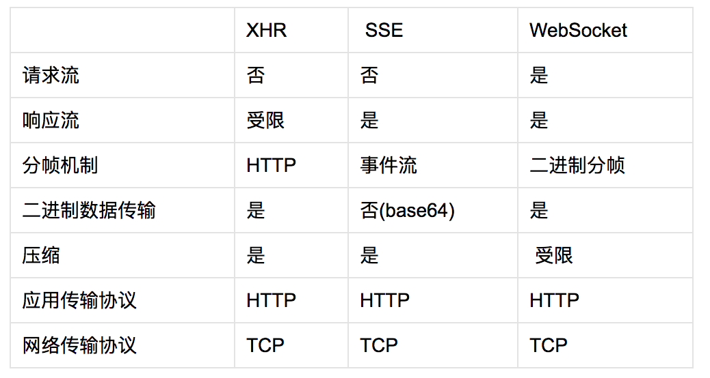

#### XHR

- 支持请求超时
- 支持传输二进制和文本数据
- 支持应用重写媒体类型和编码响应
- 支持监控每个请求的进度事件
- 支持有效的文件上传
- 支持安全的跨来源请求

#### CORS（Cross-Origin Resource Sharing） 跨源资源共享

浏览器会自动追加受保护的 Origin HTTP 首部，包含着发出请求的来源。远程服务器可以检查 Origin 首部，决定是否接受该请求，如果接受就返回 Access-Controll-Allow-Origin 响应首部。如果不接受这个请求，在响应中不包含 Access-Controll-Allow-Origin 首部即可。

- CORS 请求会省略 cookie 和 HTTP 认证等用户凭据
- 客户端被限制只能发送“简单的跨域请求”，包括只能使用特定的方法以及只能访问可以通过 XHR 发送并读取的 HTTP 首部

##### 启用 cookie 和 HTTP 认证

客户端必须在发送请求时通过 XHR 对象发送额外的属性 (withCredentials)，而服务器也必须以适当的首部(Access-Control-Allow-Credentials)响应。

#### 轮询

轮询最适合间隔时间长，新事件到达时间有规律，且传输数据量大的场景，这个组合可以抵消多余的 HTTP 开销，并将消息交付的延迟最小化

#### 长轮询

通过将连接一直保持打开到有更新，就可以把更新立即从服务器发送给客户端。可以解决消息交付延迟的问题，同时也消灭了空检查，减少 XHR 请求次数和轮询的整体开销。

#### 长轮询(Comet) VS 轮询

- 如果容许一定时间的延迟，定时轮询可能更有效
- 更新频率很高的情况下，定时轮询是一个简单的‘更新机制’，不仅能减少请求次数，还能- 减少对手机电量的消耗
- 如果更新频率已知且固定，长轮询更有效

在服务器上累积低优先级的更新，同时对高优先级消息则立即触发更新。

- XHR 轮询会导致消息延迟和很高的请求开销
- XHR 长轮询能最小化延迟，但开销还是很高
- XHR 对流的支持有限，且在内存中缓冲所有数据

#### 服务器发送事件

SSE（Server-Sent Events）让服务器可以向客户端流式发送文本消息。SSE 让处理实时数据变得简单高效。

SSE 设计了两个组件： EventSource 和 新的“事件流”数据格式，EventSource 可以让客户端以 DOM 事件的形式接收到服务器推送的通知，而新数据格式则用于交付每一次更新。

- SSE 可以通过在推送任何消息时向客户端发送一个 retry 命令，自定义时间间隔
- 服务器可以给每条消息关联任意 ID 字符串，浏览器会自动记录最后一次收到的消息 ID ，并在发送重连请求时自动在 HTTP 首部追加 Last-Event_ID
- 会触发自定义的 DOM 事件处理程序

**局限性**

- 只能从服务器向客户端发送数据，不能满足需求请求流的场景(比如向服务器流式上传大文件)
- 只能传输 UTF-8 数据。即使传输二进制流，效率也不高

```js
var source = new EventSource("/path/stream-url");

source.addEventListener("foo", function (events) {
    //...
});

source.onmessage = function (event) {
    //...

    if (event.id === "CLOSE") {
        socurce.close();
    }
}
```

#### WebSocket

WebSocket 可以实现客户端与服务器间双向、基于消息的文本或二进制数据传输，提供了下面的服务。

- 连接协商和同源策略
- 与既有 HTTP 基础设施的互操作
- 基于消息的通信和高效消息分帧
- 子协议协商及可扩展能力

```js
var ws = new WebSocket("wss://example.com/socket");

ws.onerror = function (error) {...}
ws.onclose = function () {...}

ws.onopen = function () {
    ws.send("connection established. hello server!");
}

ws.onmessage = function (msg) {
    if (msg.data instanceof Blob) {
        processBlob(msg.data);
    } else {
        processText(msg.data);
    }
}
```

#### WS 与 WSS

- ws 表示纯文本通信
- wss 表示使用加密信道通信

WebSocket 的连接协议也可以用于浏览器之外的场景，可以通过非 HTTP 协商机制交换数据。

#### 接收文本和二进制数据

WebSocket 通信只涉及消息、应用代码无需担心缓存、解析、重新接收到的数据。onmessage 回调只会在客户端接收到全部数据才会被调用。

如果接收的数据是二进制数据，将其强制转换成 ArrayBuffer。 Blob 对象一般代表一个不可变的文本或原始数据。

#### 发送文本和二进制数据

send() 方法是异步的，提供的数据会在客户端排队，而函数则立即返回。

#### 子协议协商

WebSocket 协议对每条消息的格式事先不作任何假设，仅用一位标记消息是文本还是二进制，以便客户端和服务器有效地解码数据，而除此之外的消息内容都是未知的。

WebSocket 构造函数可以接受一个可选的子协议名字的数组，通过这个数组，客户端可以向服务器通告自己能够理解或希望服务器接受的协议。这个协议数组会发送给服务器，服务器从中挑选一个。

#### WebSocket 协议

WebSocket 通信协议包含两个高层组件：开放性 HTTP 握手用于协商连接参数，二进制消息分帧机制用于支持低开销的基于消息的文本和二进制数据传输。

#### HTTP 升级协商

在交换数据之前，客户端必须与服务器协商适当的参数以建立连接。是通过 HTTP 完成握手，完成握手后，该链接就可以用作双向通信交换 WebSocket 消息，从此之后，客户端与服务器之间不会再发生 HTTP 通信，一切由 WebSocket 协议接管。

#### 使用场景及性能

**1.请求和响应流**

WebSocket 在两个方向上都能保证文本和二进制应用数据的低延迟交付。

XHR 是专门为 "事务型" 请求/响应通信而优化的

SSE 实现服务器到客户端的高效、低延迟的文本数据流

**2.消息开销**

应用消息会被拆分为一个或多个帧，每个帧会添加 2~14 字节的开销。

SSE 会给每个消息添加 5 字节，仅限于 UTF-8内容

HTTP 1.x 请求 会携带 500~800 字节的 HTTP 元数据，加上 cookie

HTTP 2.0 压缩 HTTP 元数据，可以显著减少开销，如果请求都不修改首部，那么开销可以低至 8 字节

**3.数据效率及压缩**

**4.自定义应用协议**

流式数据处理可以让我们在客户端和服务器间自定义协议，代价是错过浏览器提供的很多服务(认证、缓存、压缩等)，初次 HTTP 握手执行某些连接参数的协商，而一旦建立会话，后续客户端与服务器间的数据流对浏览器都将不透明。

简单但有效的策略：使用 WebSocket 交付无需缓存的数据，如实时更新和应用"控制"消息，再触发 XHR 请求通过 HTTP 协议取得其他资源。

#### 性能检查表

- 使用安全 WebSocket 实现可靠的部署
- 密切关注腻子脚本的性能
- 利用子协议协商确定应用协议
- 优化二进制净荷以最小化传输数据
- 考虑压缩 UTF-8 内容以最小化传输数据
- 设置正确的二进制类型以接收二进制净荷
- 监控客户端缓存数据的量
- 切分应用消息以避免队首拥塞
- 合用的情况下利用其他传输机制

WebSocket 用在移动应用中，需要注意的

- 节约用电
- 消除周期性及无效的数据传输
- 内格尔及有效的服务器推送
- 消除不必要的长连接


#### WebRTC

Web Real-Time Communication(Web 实时通信)由一组标准、协议和 JavaScript API 组成，用于实现浏览器之间的音频、视频及数据共享。WebRTC 使得实时通信变成一种标准功能。

#### 三个主要的 API

- MediaStream: 获取音频和视频流
- RTCPeerConnection: 音频和视频数据通信
- RTCDataChannel: 任意应用数据通信

WebRTC 通过 UDP 传输数据，低延迟和及时性才是关键。

#### 使用场景

- 音频、视频和数据流
- 多方通信架构
- 基础设施及容量规划
- 数据效率及压缩

#### 性能检查表

**1.发信服务**

- 使用低延迟传输机制
- 提供足够的容量
- 建立连接后，考虑使用 DataChannel 发信

**2.防火墙和 NAT 穿越**

- 初始化 RTCPerrConnection 时提供 STUN 服务器
- 尽可能使用增量 ICE，虽然发信次数多，但建立连接速度快
- 提供 STUN 服务器，以备端到端连接失败后转发数据
- 预计并保证 TURN 转发时容量足够用

**3.数据分发**

- 对于大型多方通信，考虑使用超级节点或专用的中间设备
- 中间设备在转发数据前，考虑先对其进行优化压缩

**4.数据效率**

- 对音频和视频流指定适当的媒体约束
- 优化通过 DataChannel 发送的二进制净荷
- 考虑压缩通过 DataChannel 发送UTF-8 数据
- 监控DataChannel缓冲数据的量，同时注意适应网络条件变化

**5.交付及可靠性**

- 使用乱序交付避免队首阻塞
- 如果使用有序交付，把消息大小控制到最小，以降低队首阻塞的影响
- 发送小消息(<1150字节)，以便将分段应用消息造成的丢包损失将至最低
- 对部分可靠交付，设置适当的重传次数和超时间隔，正确的设置取决于消息大小，应用数据类型和端与端之间的延迟

#### 对比


