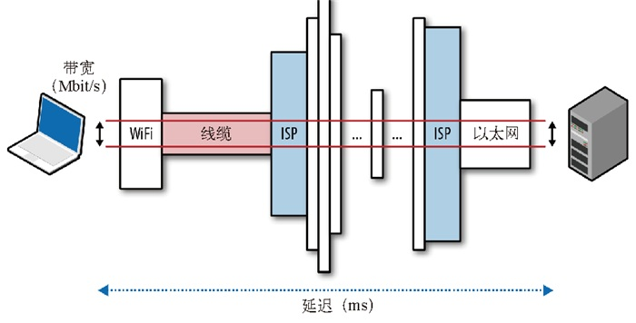
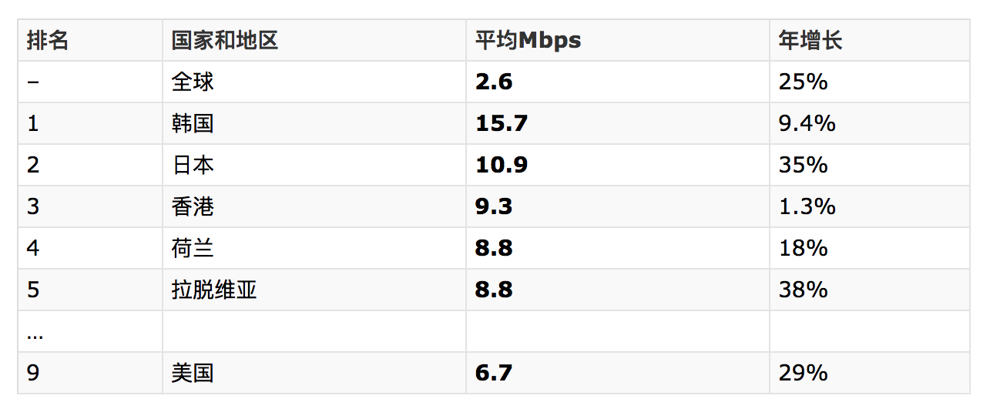

#### 延迟与带宽

* 速度越快，用户粘性越高
* 速度越快，用户忠诚度越高
* 速度越快，用户转化率越高

简言之，速度是关键。

对所有网络通信都有决定性影响的两个方面：延迟和带宽

#### 延迟

分组从信息源发送到目的地所需的时间

#### 带宽

逻辑或物理通信路径最大的吞吐量

#### 小栗子

2011 年初，华为与 Hibernia Atlantic 合作铺设一条横跨大西洋，连接伦敦和纽约的近 5000km 的海底电缆。铺设这条海底光缆的唯一目的就是减少城市间的路由，为交易商节省 5ms 的延迟。铺设光缆总耗资预计达 4 亿美元。

简单计算一下，不难得出节省 1ms 的成本是 8000万美元，由此可以说明延迟的代价。

#### 延迟的构成

延迟是消息或者分组从起点到终点经历的时间。

这个定义简单明了，但却掩盖了很多有用的信息。任何系统都有许多因素可能影响传送消息的时间。

路由器是负责在客户端和服务器之间转发消息的设备。

**1. 传播延迟**

消息从发送断到接收端需要的时间，是信号传播距离和速度的函数

**2. 传输延迟**

把消息中的所有比特转移到链路中需要的时间，是消息长度和链路速率的函数

**3. 处理延迟**

处理分组首部、检查位错误及确定分组目标所需的时间

**4. 排队延迟**

到来的分组排队等待处理的时间

总延迟时间 = 传播延迟 + 传输延迟 + 处理延迟 + 排队延迟

传播时间取决于距离和信号通过的媒介；而传输延迟由传输链路的速率决定，与客户端到服务器端的距离无关。

分组到达路由器，路由器需要检测分组的首部，确定出站，这就是处理延迟时间。如果分组到达的速度超过路由器的处理能力，分组就要在入站缓冲区排队，这就是排队延迟。

#### 结论

大多数网站性能的瓶颈都是延迟，而不是带宽！

#### 带宽

#### 目标

高带宽、低延迟