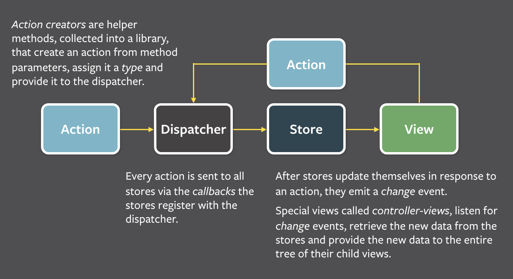

React 0.13 提供了对 ES6 的支持，取消了函数的自动绑定。也就是说，以前可以这样去绑定一个事件：

```html
<button onClick={this.handleSubmit}>Submit<button>
```

用 ES6 定义语法定义的组件，必须这样写：

```html
<button onClick={this.handleSubmit.bind(this)}>Submit</button>
```

做事件绑定时我们需要通过 bind 来实现一个闭包以让事件处理函数自带上下文信息，这是由 JavaScript 语言特性决定的。

在 React 0.13 版本之前，React 会自动在初始化时对组件的每一个方法做一次这样的绑定，类似于 `this.func = this.func.bind(this)`。

React 最有价值不是高性能虚拟 DOM、服务器端 Render、封装过的事件机制、完善的错误提示信息，而是声明式的、直观的编程方式。

#### JSX

JSX 是 React 的核心组成部分，它使用 XML 标记的方式直接声明界面，界面组件之间可以互相嵌套。

#### 组件

之前我们理解组件是这样的：某个独立功能或界面的封装，达到复用、或是业务逻辑分离的目的。

React 是这样理解：

```
所谓组件，就是状态机器 React 将用户界面看做简单的状态机器。当组件处于某个状态时，那么就输出这个状态对应的界面。
在 React 中，你简单的去更新某个组件的状态，然后输出基于新状态的整个界面。React 负责以最高效的方式去比较两个界面并更新 DOM 树。
```

#### 每一次界面变化都是整体刷新

数据模型驱动 UI 界面的两层编程模型从概念角度看上去是更直观，而在实际开发中却是非常困难的。一个数据模型的变化可能会导致分散在界面多个角落的 UI 同时发生变化。在 Facebook 内部被称之为 "Cascading Updates"，即层叠式更新，意味着 UI 界面之间会有一种相互依赖的关系。

React 通过虚拟 DOM 来解决层叠式更新，让框架来解决哪些局部 UI 需要更新的问题。

#### 单向数据流动 Flux

Flux 提倡的是单向数据流动，即永远只有从模型到视图的数据流动。



Dispatcher 是一个全局的分发器负责接收 Action，而 Store 可以在 Dispatcher 上监听到 Action 并作出相应的操作。

#### 让数据模型也变简单 Immutability

Immutability 含义是只读数据，React 提供使用只读数据来建立数据模型。所有数据都是只读的，如果需要修改它，那么你只能产生一份保护新的修改的数据。

#### React 思想的衍生

React 对 UI 层进行了完美的抽象，写 Web 界面时甚至能够做到完全的去 DOM 化，开发者无需进行任何 DOM 操作。React Native 正是将浏览器基于 DOM 的 UI 层替换成了 IOS 或 Android 的原生控件。
