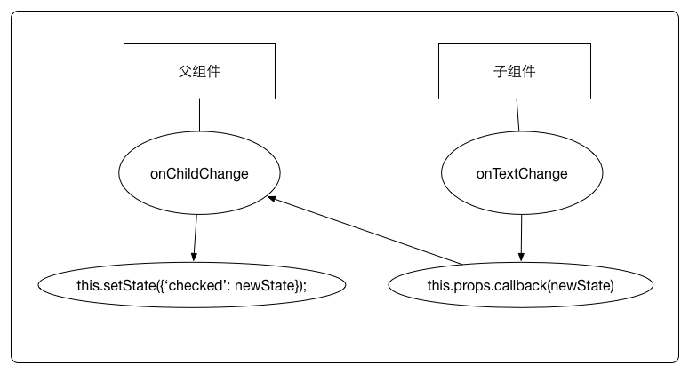

React 通信就是组件之间相互传递数据，一般分为父组件向子组件、子组件向父组件、兄弟组件之间进行通信。在 React 中通信是单向的，数据必须是由一方传递到另一方。

#### 父组件向子组件通信

父组件可以向子组件传递 props，向子组件进行通信。

* 1.父组件向子组件通信

```js
class Parent extends Component {
  render() {
    return <Child msg="hello" />;
  }
}

// 父组件向子组件传递 msg
class Child extends Component{
  render() {
    return (
      <div>
        <p>{this.props.msg}</p>
      </div>
    );
  }
}
```
* 2.祖先组件向子组件通信

如果父组件与子组件之间不止一层级，可以通过 `...运算符`，将父组件的信息，以更简洁的方式传递给更深层级的子组件。

```js
class Parent extends Component {
  render() {
    return <Child_1 msg="hello" />;
  }
}

// 通过 ... 运算符 向 Child_1_1 传递 Parent 组件的信息
class Child_1 extends Component{
  render() {
    return (
       <div>
        <p>{this.props.msg}</p>
        <Child_1_1 {...this.props}/>
      </div>
    )
  }
}

// 可以接受 Child_1 和 Parent 组件的信息
class Child_1_1 extends Component{
  render() {
    return <p>{this.props.msg}</p>
  }
}
```

父组件通过 props 向子组件通信是最简单，也是最常用的。父级组件(Parent)的 props 或 state 发生改变，会触发组件本身及其子组件(Child_1、Child_1_1)的 render。

对于嵌套太深的父级组件向子组件通信，从外到内的通信成本会非常高，通过 props 传递值的优势就不会那么明显。因此建议在开发过程中，减少组件的层次。

#### 子组件向父组件通信

父组件向子组件通信可以通过 props 的方法，自顶向下的向子组件进行通信。而子组件向父组件通信，同样也需要父组件向子组件传递 props 进行通信，只是父组件传递的是 `作用域为父组件自身的函数，子组件调用该函数，将子组件想要传递的信息作为参数，传递到父组件的作用域中`。

```js
// 父组件
class Parent extends Component {
  constructor(props) {
    super(props);
    this.state = {
      // 默认是
      msg: 'start'
    }
    // bind this
    this.handle = this.handle.bind(this)
  }

  handle(msg) {
    this.setState({
      msg
    });
  }

  render() {
    return (
      <div>
        <p>child msg: { this.state.msg }</p>
        <Child onFunc = { msg => this.handle(msg) } />
      </div>
    );
  }
}

// 子组件
class Child extends Component{
  componentDidMount() {
    setTimeout(() => {
      // 向父组件通信，传递 msg
      this.props.onFunc('end')
    }, 1000);
  }

  render() {
    return (
      <div>
        <p>child component</p>
      </div>
    )
  }
}
```



这种方式并不适合嵌套太深的组件间通信，因此建议在开发过程中，尽量避免在嵌套太深组件中中使用此方法。

#### 兄弟组件间的通信

兄弟组件唯一的关联点，就是拥有相同的父组件，借鉴上面两种关系的通信方法。如果组件 Child_1 向 Child_2 进行通信。可以先通过 Child_1 向 Parent 组件进行通信，然后由 Parent 向 Child_2 组件进行通信。

这个方法存在这样一个问题，Parent 的 state 发生变化，会触发 Parent 及从属于 Parent 的子组件的 render。一般不建议使用这种方法进行通信，否则会触发子组件频频的 render。

上面三种方法都是通过 props 进行通信的，虽然简单易用，但并不适合所有场景。来让我们看看其他方法。

#### content(上下文)

使用上下文，可以让子组件直接访问祖先的数据和函数，无需从祖先组件一层层的传递到子组件中。

```js
// 父组件
class Parent extends Component {
  constructor(props) {
    super(props);
    this.state = {
      msg: 'React',
    };
    this.handle = this.handle.bind(this);
  }

  handle(item) {
    this.setState({
      curItem: item
    });
  }
  // 区别: 定义getChildContext
  getChildContext() {
    return {
      msg: this.state.msg,
      handle: this.handle,
    }
  }

  render() {
    return (
      <div>
        <Child_1 />
        <Child_2 changeMsg={this.handle}/>
      </div>
    )
  }
}

// 区别: 定义 childContextTypes, 类似 propTypes
Parent.childContextTypes = {
  msg: PropTypes.string,
  handle: PropTypes.func,
};

// 子组件 Child_1
const Child_1 = ({children}, context) =>
  <button>
    <div>{children}</div>
    {this.context.msg}
  </button>;

Child_1.contextTypes = {
  msg: PropTypes.string
};

// 子组件 Child_2 类似，代码省略...
```

**几点说明**

* childContentTypes 是用于验证上下文的数据类型，这个属性是必须要有的，否则会报错
* getChildContent 用于指定子组件可以访问的上下文数据
* 子组件需在 contentTypes 中指定要访问的数据，否则 this.content 访问不到

通过这种方法，子组件可以很简单的向父级组件通信，不用再去处理嵌套的 props 传递了。

#### 观察者模式

观察者模式也叫做发布者-订阅者模式，发布者发布事情，订阅者监听事件并做出反应。
事件绑定和解绑可以分别放在 componentDidMount 和 componentWillUnMount 中。由于事件是全局的，最好保证在 componentWillUnMount 中解绑事件。

事件可以很好的解决组件间通信，但频繁的使用事件实现组件通信会使整个程序的数据流向变得复杂。因此，组件间的沟通尽量还是遵循单向数据流动。

```js
// eventProxy.js
'use strict';
const eventProxy = {
  onObj: {},
  oneObj: {},
  // 注册
  on: function(key, fn) {
    if(this.onObj[key] === undefined) {
      this.onObj[key] = [];
    }
    this.onObj[key].push(fn);
  },
  // 注册一次
  one: function(key, fn) {
    if(this.oneObj[key] === undefined) {
      this.oneObj[key] = [];
    }
    this.oneObj[key].push(fn);
  },
  // 解绑
  off: function(key) {
    this.onObj[key] = [];
    this.oneObj[key] = [];
  },
  // 触发
  trigger: function() {
    let key, args;
    if(arguments.length == 0) {
      return false;
    }
    key = arguments[0];
    args = [].concat(Array.prototype.slice.call(arguments, 1));

    if(this.onObj[key] !== undefined
      && this.onObj[key].length > 0) {
      for(let i in this.onObj[key]) {
        this.onObj[key][i].apply(null, args);
      }
    }
    if(this.oneObj[key] !== undefined
      && this.oneObj[key].length > 0) {
      for(let i in this.oneObj[key]) {
        this.oneObj[key][i].apply(null, args);
        this.oneObj[key][i] = undefined;
      }
      this.oneObj[key] = [];
    }
  }
};

export default eventProxy;
```

#### Redux

Redux 对于组件间的解耦提供了很大的便利，如果你在考虑该不该使用 Redux 的时候，社区里有一句话说，`当你不知道该不该使用 Redux 的时候，那就是不需要的`。

Redux 用起来一时爽，重构或者将项目留给后人的时候，就是个大坑，Redux 中的 dispatch 和 subscribe 方法遍布代码的每一个角落。

Flux 设计中的 Controller-Views 概念就是为了解决这个问题出发的，将所有的 subscribe 都置于 Parent 组件（Controller-Views），由最上层组件控制下层组件的表现，然而，这不就是我们所说的子组件向父组件通信这种方式了。
