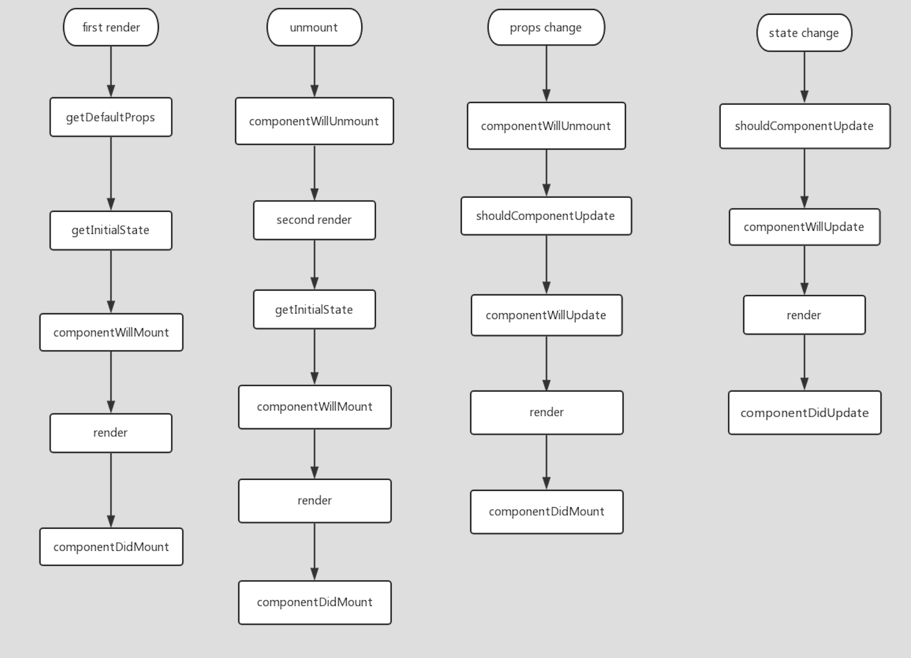

React 组件的生命周期方法都可以被分割成四个阶段：初始化、挂载阶段（mounting）、更新阶段、卸载阶段（unmounting）

#### 生命周期时序图

#### 生命周期流程图

#### 生命周期函数

**1.getDefaultProps**

每个组件实例来讲，这个方法只会调用一次，该`组件类`的后续所有实例都不在调用，props 不允许修改的。

**2.getInitalState**

每个组件的实例只会调用一次，用来初始化每个实例的 `state`，在这个方法内可以访问到 `props`。props 和 state 的主要区分是 state 只存在组件内部，props 在所有实例中共享。

getDefaultProps 和 getInitalState 的区别是：getDefaultProps 对于`组件类`来说只调用一次，而 getInitalState 对于每个`组件`的实例只会调用一次。

每次修改 `state`，都会触发 `render` 方法。

**3.componentWillMount**

该方法只会调用一次，是在 render 方法调用之前修改 state 最后一次机会。

在此方法内调用 setState 将不会导致重复render。

**4.render**

该方法会创建一个虚拟的 DOM，用来标识组件的输出，render 方法是唯一必须的方法。

render 方法需要满足下面几点。

* 只能通过 this.props 和 this.state 访问数据，不能修改他们
* 可以返回 null、false 或者任何 React 组件
* 只能出现一个顶级组件，不能返回一组元素
* 不能改变组件的状态
* 不能修改 DOM 的输出

**5.componentDidMount**

该方法调用时，已经渲染出真实的 DOM，可以访问到真实的 DOM。在 渲染真实 DOM 之前，组件是存在内存中的一种数据结构，即虚拟 DOM。

如果要从组件获取真实的 DOM 节点，可以通过 ref 属性获取。

**6.componentWillReceiveProps**

组件的 props 属性可以通过父组件来更改，这时 componentWillReceiveProps 会被调用，在这个方法里可以更新 state。

在此方法内调用 setState 将不会导致重复render，还可以通过 this.props 访问旧的属性。

**7.shouldComponentUpdate**

如果确定组件的 props 或者 state 的改变不需要重新渲染，可以在这个方法里返回 false 来阻止组件的重新渲染。

**8.componentWillUpdate**

在组件接收到了新的 props 或者 state 即将进行渲染前，componentWillUpdate 会被调用。在此方法里不能更新 props 或者 state。

**9.componentDidUpdate**

在组件重新渲染之后，componentDidUpdate 方法会被调用。可以在这个方法里访问并修改 DOM。

**10.componentWillUnmount**

组件卸载之前会调用 componentWillUnmount，在此方法里可以做一些清理和销毁工作。

#### 总结

能使用 setState 的生命周期函数 componentWillMount、componentDidMount、componentWillReceiveProps。