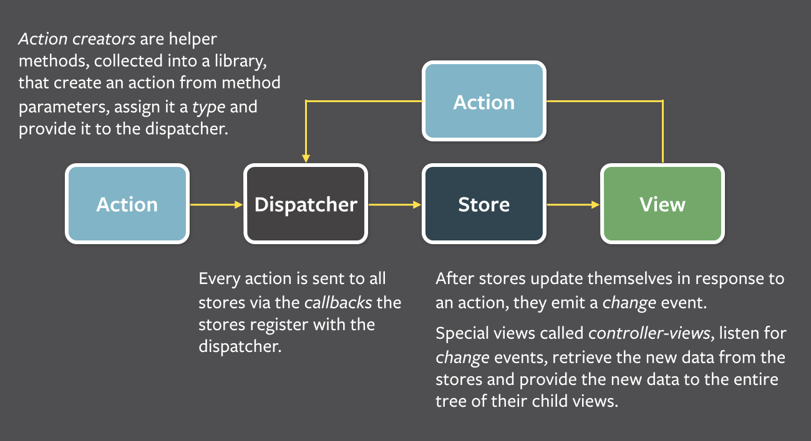

Flux 的提出主要是针对现有前端 MVC 框架的局限总结出的一套基于 dispatcher 的前端应用框架模式。如果用 MVC 的命名习惯，它应该叫 `ADSV(Action Dispatcher Store View)`。

Flux 的核心思想就是数据和逻辑永远单向流动，Flux 的 dispatcher 定义了严格的规则来限定我们对数据的修改操作。同时 store 中不能暴露 setter 的设定也强化了数据修改的纯洁性，保证了 store 的数据确定应用唯一的状态。

#### 基本概念

FLux 应用由 3 大部分组件：dispatcher、store 和 view。

* dispatcher: 负责分发事件
* store: 负责保存数据，同时响应事件并更新数据
* view: 负责订阅 store 中的数据，并使用这些数据渲染相应的页面

##### 1. dispatcher 与 action

dispatcher 是 Flux 中最核心的概念。dispatcher 实现非常简单，只需要关心 register(callback) 和 dispatch(action) 这两个 API 即可。

register 方法用来注册一个监听器，而 dispatch 方法用来分发一个 action。action 是一个普通的 JavaScript 对象，一般包含 type、payload 等字段，用于描述一个事件以及需要改变的相关数据。

##### 2.store

store 负责保存数据，并定义修改数据的逻辑。同时调用 dispatcher 的 register 方法将自己注册为一个监听器。每当我们使用 dispatcher 的 dispatch 方法分发一个 action 时， store 注册的监听器就会被调用，同时得到这个 action 的参数。

store 对外只暴露 getter 而不暴露 setter，这意味着在 store 之外你只能读取 store 中的数据而不能进行任何修改。

##### 3.controller-view

controller-view 是整个应用最顶层的 view，主要进行 store 与 React 组件(View 层)的绑定、定义数据更新及传递的方式。

controller-view 会调用 store 暴露的 getter 获取存储其中的数据并设置为自己的 state，在 render 时以 props 的形式传给自己的子组件。

##### 4.view

在 Flux 中，view 除了显示界面，还有一条特殊的约定：如果界面操作需要修改数据，则必须使用 dispatcher 分发一个 action。

##### 5.actionCreator

actionCreator 就是用来创造 action。

#### 核心思想

Flux 的中心化控制让人称道，中心化控制让所有的请求与改变都只能通过 action 发出，统一由 dispatcher 来分配。好处是 view 可以保持高度简洁，它不需要关心太多的逻辑，只需要关心传入的数据；中心化还控制了所有数据，发生问题可以随时查询。

#### 不足

Flux 的冗余代码太多，Flux 源码汇总几乎只有 dispatcher 的实现，每个应用都需要手动创建一个 dispatcher 的示例，这让开发者觉得很烦恼。
