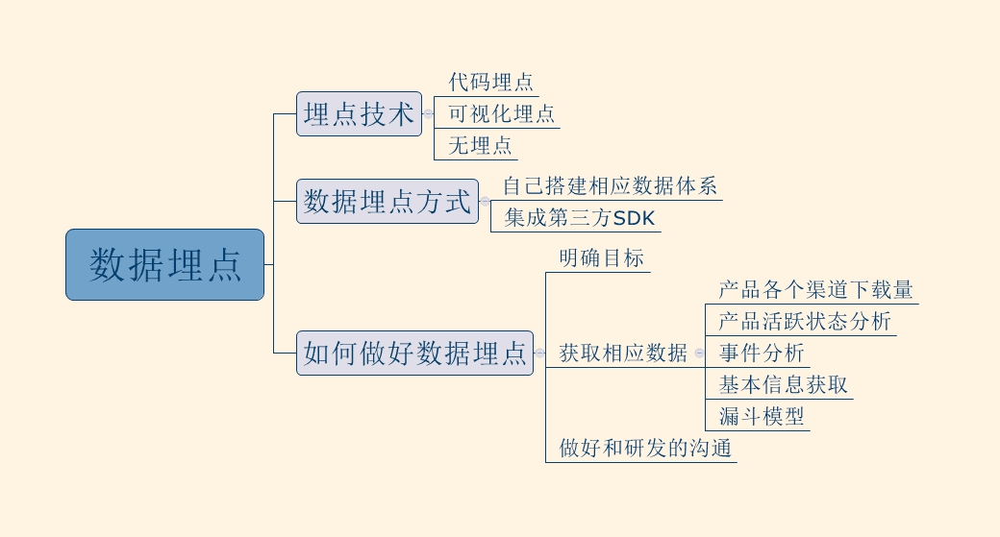
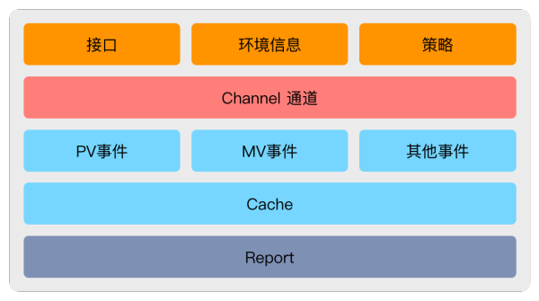
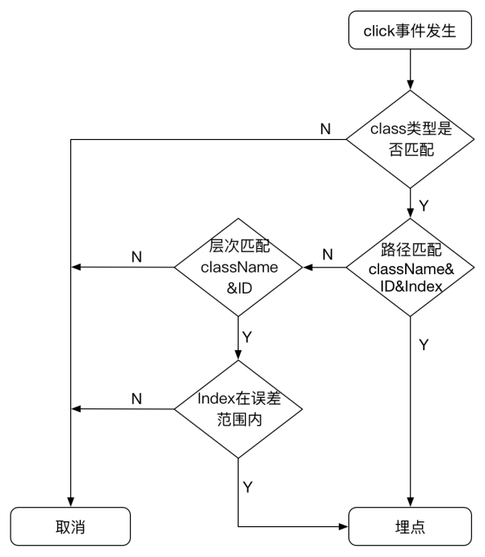

数据埋点实际上就是pm或运营分析人员，基于统计分析需要，对用户行为的每一个事件进行埋点布置，并通过SDK上报埋点的数据结果，进行分析，并进一步优化产品或指导运营。

构建一个数据平台，大体上包括数据采集、数据上报、数据存储、数据计算以及数据可视化展示等几个重要的环节。其中，数据采集与上报是整个流程中重要的一环，只有确保前端数据生产的全面、准确、及时，最终产生的数据结果才是可靠的、有价值的。

前端埋点技术主要分为下面三类：

* 第一类是代码埋点，即在需要埋点的节点调用接口直接上传埋点数据，友盟、百度统计等第三方数据统计服务商大都采用这种方案
* 第二类是可视化埋点，即通过可视化工具配置采集节点，在前端自动解析配置并上报埋点数据，从而实现所谓的“无痕埋点”， 代表方案是已经开源的Mixpanel
* 第三类是“无埋点”，它并不是真正的不需要埋点，而是前端自动采集全部事件并上报埋点数据，在后端数据计算时过滤出有用数据，代表方案是国内的GrowingIO

### 代码埋点

代码埋点主要关注的是数据结构的规范性、埋点接口的易用性、上报策略的可靠性等问题。

开发者需要手动在需要埋点的节点处（例如：点击事件的回调方法、列表元素的展示回调方法、页面的生命周期函数等等）插入这些埋点代码。

可以看出，代码埋点是一种典型的命令式编程，因此埋点代码常常要侵入具体的业务逻辑，这使埋点代码变得很繁琐并且容易出错。因此，最直接的做法就是将埋点代码与业务逻辑解耦，也就是“声明式编程”，从而降低埋点的难度。

#### 优点

* 使用者控制精准，可以非常精确地选择什么时候发送数据
* 使用者可以比较方便地设置自定义属性、自定义事件，传递比较丰富的数据到服务端

#### 缺点

* 埋点代价比较大，每一个控件的埋点都需要添加相应的代码，工作量大
* 更新代价比较大

### 可视化埋点

从代码埋点到可视化埋点其实是一个非常顺理成章的演进。既然代码埋点代价大，每一个埋点都需要写代码，那么，就参考 Visual Studio 等一系列现代 IDE 的做法，用可视化交互手段来代替写代码即可；既然每次埋点更新都需要等待APP的更新，那么，就参考现在很多手游的做法，把核心代码和配置、资源分开，在APP启动的时候通过网络更新配置和资源即可。

* 优点：高度的可配置和易用性，解决了代码埋点代价大和更新代价大两个问题
* 缺点：可视化埋点能够覆盖的功能有限，缺乏灵活性和针对性，它无法像有码埋点一样自定义事件，无法应对较深入的行为分析要求

### 声明式埋点

声明式埋点的思路是将埋点代码和具体的交互和业务逻辑解耦，开发者只用关心需要埋点的控件，并且为这些控件声明需要的埋点数据即可，从而降低埋点的成本。

我们通过自定义常用的UI控件，例如TextView、LinearLayout、ListView等，重写了事件响应方法，在这些方法内部自动填写埋点代码。重写控件的好处在于可以拦截到更多的事件，执行效率高并且运行稳定。但其弊端也非常明显，移植成本很高！

声明式埋点能够替代所有的代码埋点，并且能解决早期遇到的移植成本高等问题。但是其本质上还是一种代码埋点，只是埋点的代码减少了，并且不再侵入业务逻辑了。如果要满足动态部署与修复埋点的需求，就需要彻底消灭写死在前端的埋点代码。

### 无埋点

无埋点则是先尽可能收集所有的控件的操作数据，然后再通过界面配置哪些数据需要在系统里面进行分析。“无埋点”相比框架式埋点的优点，一方面是解决了数据“回溯”的问题，另一方面，“无埋点”方案也可以自动获取很多启发性的信息。

我们注意到，之所以声明式埋点还需要写死代码，主要有两个原因：第一是需要声明埋点控件的唯一事件标识；第二是有的业务字段需要在前端埋点时携带，而这些字段是在运行时才可获知的值。

对于第一点，我们可以尝试在前后端使用一致的规则自动生成事件标识，这样后端就可以配置前端的埋点行为，从而做到自动化埋点。对于第二点，可以尝试通过某种方式将业务数据自动与埋点数据关联，这种关联可以发生在前端，也可以发生在后端。

* 优点：无需埋点，方便快捷
* 缺点：行为记录信息少，传输压力大

#### 事件标识

为了自动生成事件标识，我们需要获取每个控件自身的ID、类名以及位于所属父组件的Index等特征信息，并逐级向上遍历找到根节点。根节点一般是手动标记的，如果没有标记则默认是视图层次树的顶层节点。最后，将遍历产生的路径上所有节点的特征信息组合在一起，就是这个事件的标识。

#### 数据关联

更常见的数据关联发生在前端数据之间。当页面跳转时，通过传递规范的跳转URI Scheme，将业务数据传递给下个页面，并且自动填入这个页面的PV事件中。而该页面内产生的所有其他事件，都会携带与PV事件相同的业务数据。

#### 小结

通过自动产生事件标识并进行数据关联，我们就能够实现“无痕埋点”了，并且埋点节点可以通过配置文件动态下发，从而具备了动态部署与修复埋点的能力。

但需要注意的是，这种`无痕埋点`并不能解决所有问题，当业务字段无法通过数据关联获取时（这种情况比较常见），仍然需要开发者代码埋点或声明式埋点指定业务字段。

就目前实践阶段的数据来看，业务中大约70%左右的埋点需求可以通过无痕埋点解决，而对于另外30%的埋点需求，仍然需要使用声明式埋点和代码埋点。

### 总结

埋点问题不能通过单一一种技术方案来解决，在不同场景下我们需要选择不同的埋点方案。例如对于简单的用户行为类事件，可以使用无痕埋点解决；而对于需要携带大量运行时才可获知的业务字段的埋点需求，就需要声明式埋点来解决。从更高的层面来看，除了前端埋点技术的优化，埋点数据的规范化、前后端协同埋点、数据清洗和关联对于未来构建更加自动化、动态化的埋点体系同样非常重要。

### 参考链接

* [美团点评前端无痕埋点实践](https://zhuanlan.zhihu.com/p/26211623)
* [前端埋点技术介绍](https://serious.gitbooks.io/visual_point/content/ke_shi_hua_mai_dian_diao_yan_bao_gao/)
* [埋点方案汇总](http://www.itechdog.com/blog/event-tracking)